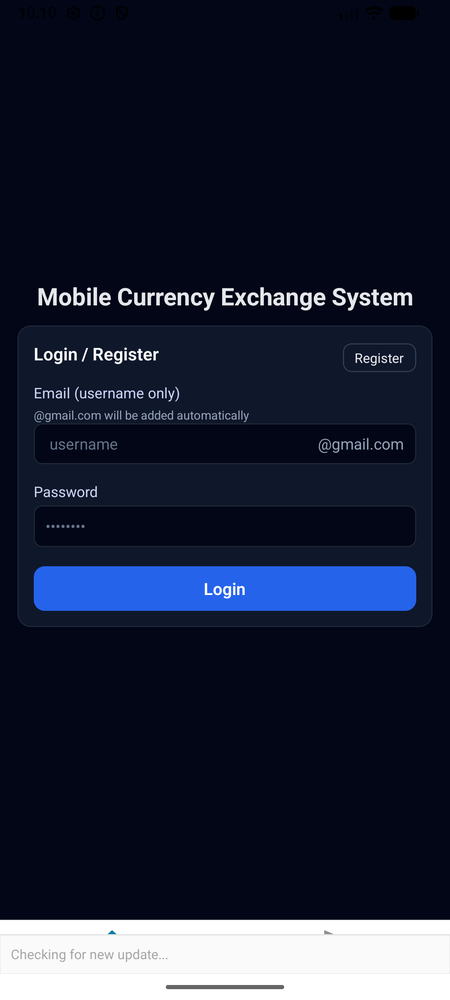
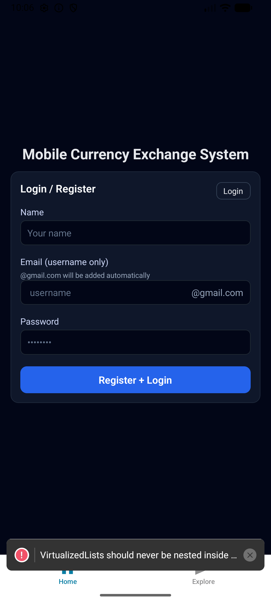
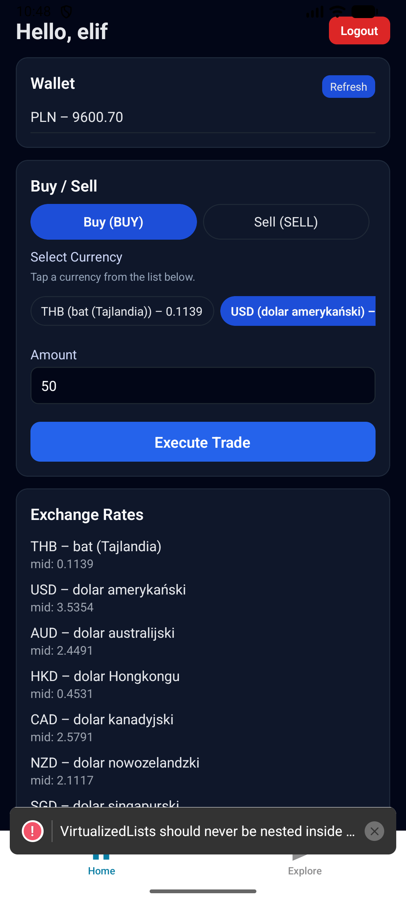
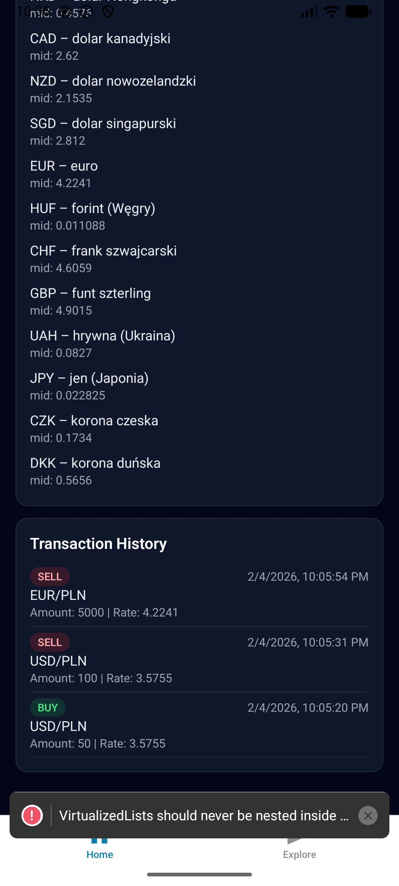
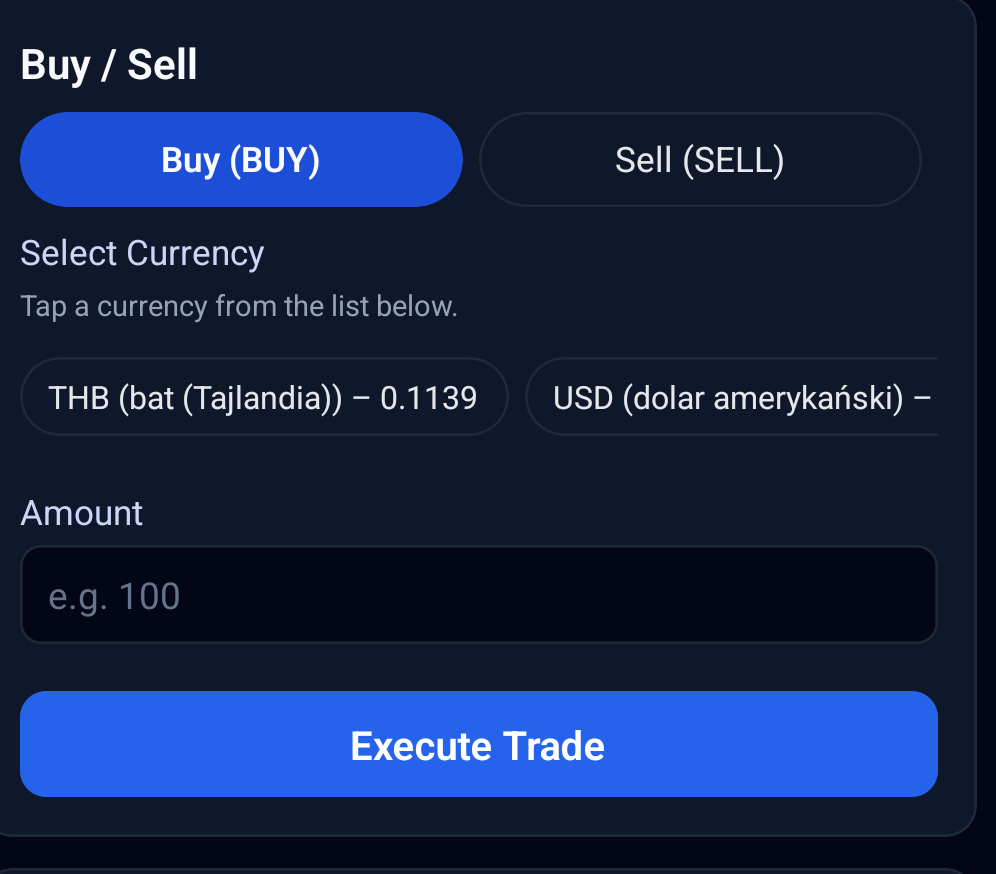
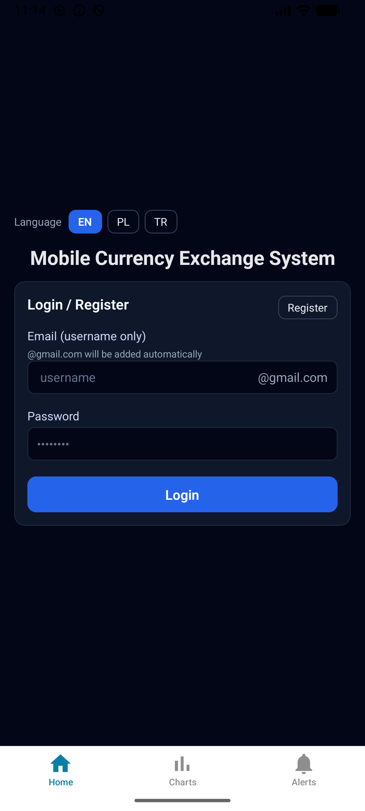
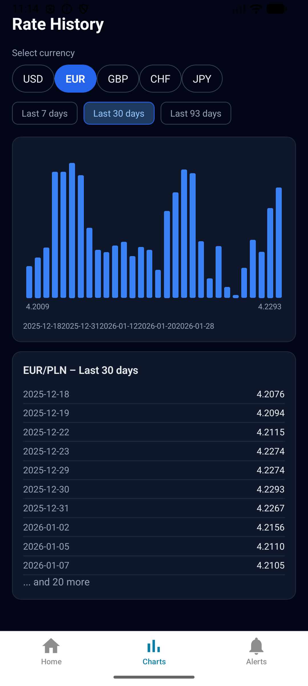
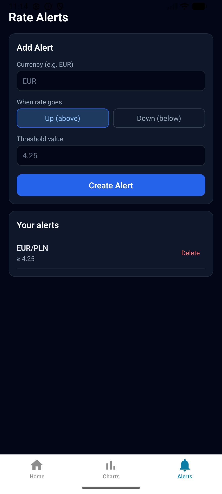

# PROJECT DOCUMENTATION

**Subject:** Networking Issues in Mobile Systems

**Part 1 – Conceptual Design**

**Project Topic:** Mobile Currency Exchange System

---

## 1. General Information

- **Project Name:** Mobile Currency Exchange System
- **Project Authors:** Elif Ezgi Emre
- **Field of Study:** Computer Science
- **Year / Semester:** 2025 / Fall
- **Supervisor:** Marcin Kacprowicz
- **Project Presentation Date:** Thursday, 29 January 2026
- **Submission Date:** 4 February 2026
- **Source code:** Available in a Git repository (GitHub, GitLab): https://github.com/ElifEzgiEmre/mobile-currency-exchange

---

## 2. Project Description

### 2.1. Project Objective

The goal of this project is to design and implement a mobile system that enables users to perform basic currency exchange operations. The project aims to practically apply concepts related to communication between a mobile application, a web service (REST), and a database, as well as integration with an external API (National Bank of Poland - NBP).

The system provides users with:
- **Real-time currency exchange rates** retrieved from the National Bank of Poland API
- **Virtual currency exchange operations** (buy/sell) using PLN (Polish Zloty) as the base currency
- **Transaction history** and wallet balance management
- **Robust network error handling** to address mobile networking challenges such as:
  - Connection timeouts
  - Network failures and packet loss
  - Weak network conditions (3G, low Wi-Fi)
  - Server unavailability

The application demonstrates practical implementation of mobile networking best practices, including timeout management, error recovery, and user-friendly error messaging.

### 2.2. Project Scope

The system consists of three main modules:

#### A. Mobile Application (React Native / Expo)

**Core Features:**
- **User Registration and Login**: Secure authentication system with email/password
- **Account Management**: User profile and wallet balance display
- **Currency Exchange Rates**: Real-time display of exchange rates from NBP API
- **Historical Rates Access**: View past exchange rates (via NBP API)
- **Buy/Sell Transactions**: Execute currency exchange operations
- **Transaction History**: View all past transactions with details
- **Wallet Balance**: Display current PLN balance
- **Rate History (Charts)**: Charts tab with currency selector (USD, EUR, GBP, CHF, JPY), time range (7/30/93 days), bar chart and date–rate list from NBP API
- **Rate Alerts**: Add, list and delete alerts; notification when rate reaches threshold; triggered alerts shown on dashboard
- **Multi-language**: English, Polish, Turkish (language selector on login)

**Technical Features:**
- Cross-platform support (Android and iOS)
- Network layer with timeout handling (7 seconds)
- Error handling and retry mechanisms
- Offline cache support for last known rates
- Responsive UI design

#### B. Web Service (REST API - Node.js/Express)

**Core Features:**
- **Business Logic Implementation**: Currency exchange office logic
- **NBP API Integration**: Fetch and process exchange rates from National Bank of Poland
- **Mobile App Communication**: RESTful API endpoints for mobile application
- **Data Validation**: Input validation and business rule enforcement
- **User Authorization**: Authentication and session management

**Technical Features:**
- REST API architecture
- NBP API integration with 5-second timeout
- Error handling and logging
- CORS support for mobile app access
- JSON data format

#### C. Database (SQL Schema)

**Core Features:**
- **User Information Storage**: User accounts and authentication data
- **Transaction Recording**: All buy/sell transactions with timestamps
- **Wallet Balance Management**: Currency wallet balances (PLN)
- **Exchange Rate Cache**: Optional caching of exchange rates
- **Notification Settings**: User preferences for rate alerts (future extension)

**Technical Features:**
- Relational database design (PostgreSQL/MySQL compatible)
- Normalized schema with proper relationships
- Primary and foreign key constraints
- Indexed fields for performance

### 2.3. Application Screenshots

The following screenshots show the implemented mobile application running on Android (emulator).

**Login Screen (F1, F2)**  
User can register with name, email (username + @gmail.com), and password, or switch to login.



**Register Screen (F1)**  
Registration form with name, email, and password fields.



**Dashboard – Wallet and Rates (F8, F3)**  
After login: greeting, PLN wallet balance, Refresh button, and exchange rates from NBP API.



**Transaction History (F9)**  
List of past transactions with type, currency pair, amount, rate, and date.



**Buy / Sell (F6, F7)**  
Currency selection, amount input, and Execute Trade. BUY/SELL toggle.



#### Extra Modules (Implemented)

The following extra modules have been implemented and are available in the application.

**Multi-language support (EN, PL, TR)**  
Language selector on the login screen; all main screens (auth, dashboard, alerts, charts) use the selected language.



**Rate History – Charts (Extra Module)**  
The app includes a **Charts** tab that shows historical exchange rates from the NBP API. The user can select a currency (USD, EUR, GBP, CHF, JPY), choose the time range (last 7, 30 or 93 days), and view a bar chart of the rate over time plus a list of dates and mid rates. This feature uses the backend endpoint `GET /api/rates/history/:code?days=30`.

*Screenshot: Charts screen with currency selector and rate history chart.*



**Rate Alerts**  
Alerts tab: add alerts (currency, direction UP/DOWN, threshold), list and delete alerts. Triggered alerts appear on the dashboard when the rate reaches the threshold.



---

## 3. System Requirements

### 3.1. Functional Requirements

| ID | Function Name | Description | Priority |
|----|---------------|-------------|----------|
| F1 | User Registration | User can create an account by providing name, email, and password. System automatically creates a default PLN wallet with initial balance (10,000 PLN). | High |
| F2 | User Login | User can authenticate with email and password. System validates credentials and grants access to the dashboard. | High |
| F3 | View Current Exchange Rates | User can view real-time exchange rates fetched from NBP API. Rates are displayed in a scrollable list showing currency code, currency name, and mid rate. | High |
| F4 | Access Historical Rates | User can view historical exchange rates through NBP API integration (via backend). | Medium |
| F5 | Account Funding | User receives initial virtual balance (10,000 PLN) upon registration. System simulates account funding. | High |
| F6 | Buy Currency | User can purchase foreign currency using PLN from their wallet. System validates balance, calculates cost based on current rate, executes transaction, and updates wallet balance. | High |
| F7 | Sell Currency | User can sell foreign currency and receive PLN in their wallet. System calculates proceeds based on current rate, executes transaction, and updates wallet balance. | High |
| F8 | View Wallet Balance | User can view their current PLN wallet balance prominently displayed on the dashboard. | High |
| F9 | View Transaction History | User can view all past buy/sell transactions with details including transaction type (BUY/SELL), currency pair, amount, exchange rate, and timestamp. | Medium |
| F10 | Refresh Data | User can manually refresh exchange rates, wallet balance, and transaction history by tapping a refresh button. | Medium |
| F11 | Network Error Handling | System displays user-friendly error messages when network requests fail, timeout, or when backend is unreachable. Messages inform user about the issue and suggest retry. | High |
| F12 | Logout | User can log out from the application and return to the login screen. Session is cleared. | Medium |
| F13 | Input Validation | System validates all user inputs (email format, numeric amounts, required fields) before processing requests. | High |
| F14 | Balance Validation | System prevents transactions when user has insufficient balance. Clear error message is displayed. | High |

### 3.2. Non-Functional Requirements

| ID | Name | Description | Category |
|----|-----|-------------|----------|
| N1 | Performance | System response time ≤ 2 seconds for API calls under normal network conditions. Database queries should complete within 500ms. | Performance |
| N2 | Network Resilience | System handles network timeouts (7 seconds for mobile app, 5 seconds for NBP API) gracefully. Implements retry mechanisms for transient failures. | Reliability |
| N3 | Security | All API communications use HTTPS. User passwords should be hashed (bcrypt/argon2) in production. Authentication tokens should be used for session management. | Security |
| N4 | Usability | Application is accessible 24/7. Core user flows (login, view rates, execute trade) should not require more than 3 taps/clicks. Interface is intuitive and follows mobile UI/UX best practices. | Usability |
| N5 | Portability | Application runs on both Android and iOS platforms using React Native/Expo framework. Code is platform-agnostic. | Portability |
| N6 | Scalability | System architecture supports horizontal scaling. Backend can handle multiple concurrent users. Database design allows for efficient querying as data grows. | Scalability |
| N7 | Error Tolerance | System continues to function even when external API (NBP) is temporarily unavailable. User receives clear error messages. Last known rates can be displayed from cache. | Reliability |
| N8 | Offline Support | Application displays last known exchange rates when network connection is lost (read-only mode). User is informed about offline status. | Usability |
| N9 | Logging & Monitoring | All critical operations (login, transactions, errors) are logged for debugging and analysis. Error logs include timestamps, user context, and error details. | Maintainability |
| N10 | Data Integrity | All transactions are atomic. Wallet balances are updated consistently. No data loss occurs during network failures. | Reliability |
| N11 | API Rate Limiting | Backend implements rate limiting to prevent abuse. NBP API calls are cached to reduce external API load. | Performance |
| N12 | Code Quality | Source code follows best practices, is well-commented, and uses version control (Git). Code is modular and maintainable. | Maintainability |

---

## 4. UML Diagrams

### 4.1. Use Case Diagram

```
┌─────────────────────────────────────────────────────────────┐
│              Mobile Currency Exchange System                 │
│                                                             │
│  ┌──────────────────────────────────────────────────────┐   │
│  │                    Mobile App                        │   │
│  │              (React Native/Expo)                    │   │
│  └───────────────────────┬─────────────────────────────┘   │
│                          │                                  │
│                          │ REST API                         │
│                          │                                  │
│  ┌───────────────────────▼─────────────────────────────┐   │
│  │              Backend API Server                       │   │
│  │              (Node.js/Express)                       │   │
│  └───────────────────────┬─────────────────────────────┘   │
│                          │                                  │
│                          │ HTTP GET                         │
│                          │                                  │
│  ┌───────────────────────▼─────────────────────────────┐   │
│  │         External API: NBP                            │   │
│  │    National Bank of Poland                          │   │
│  └──────────────────────────────────────────────────────┘   │
│                                                             │
│  ┌──────────────────────────────────────────────────────┐   │
│  │                    Database                          │   │
│  │              (PostgreSQL/MySQL)                      │   │
│  └──────────────────────────────────────────────────────┘   │
│                                                             │
│  ┌──────────────────────────────────────────────────────┐   │
│  │                    Actor: User                       │   │
│  └──────────────────────────────────────────────────────┘   │
│                                                             │
│  Use Cases:                                                 │
│  • Register User                                           │
│  • Login User                                              │
│  • View Exchange Rates                                     │
│  • View Historical Rates                                   │
│  • Buy Currency                                            │
│  • Sell Currency                                           │
│  • View Wallet Balance                                     │
│  • View Transaction History                                │
│  • Refresh Data                                            │
│  • Logout                                                  │
└─────────────────────────────────────────────────────────────┘
```

**Use Case Descriptions:**

1. **Register User**
   - **Actor:** User
   - **Precondition:** User is not logged in
   - **Main Flow:** User provides name, email, and password. System validates input, creates account, initializes PLN wallet with 10,000 PLN balance, returns success message.
   - **Postcondition:** User account created, wallet initialized

2. **Login User**
   - **Actor:** User
   - **Precondition:** User has registered account
   - **Main Flow:** User enters email and password. System validates credentials, creates session, redirects to dashboard.
   - **Postcondition:** User is logged in, dashboard displayed

3. **View Exchange Rates**
   - **Actor:** User
   - **Precondition:** User is logged in
   - **Main Flow:** User navigates to rates screen. System fetches rates from NBP API via backend, displays rates in list format.
   - **Postcondition:** Current exchange rates displayed

4. **View Historical Rates**
   - **Actor:** User
   - **Precondition:** User is logged in
   - **Main Flow:** User requests historical rates. System queries NBP API for past rates, displays historical data.
   - **Postcondition:** Historical rates displayed

5. **Buy Currency**
   - **Actor:** User
   - **Precondition:** User is logged in, has sufficient PLN balance
   - **Main Flow:** User selects currency, enters amount, confirms purchase. System validates balance, calculates cost, deducts PLN, records transaction, updates wallet.
   - **Postcondition:** Currency purchased, wallet updated, transaction recorded

6. **Sell Currency**
   - **Actor:** User
   - **Precondition:** User is logged in, has currency to sell
   - **Main Flow:** User selects currency, enters amount, confirms sale. System calculates proceeds, adds PLN to wallet, records transaction.
   - **Postcondition:** Currency sold, wallet updated, transaction recorded

7. **View Wallet Balance**
   - **Actor:** User
   - **Precondition:** User is logged in
   - **Main Flow:** User views dashboard. System retrieves wallet balance from database, displays PLN balance.
   - **Postcondition:** Current wallet balance displayed

8. **View Transaction History**
   - **Actor:** User
   - **Precondition:** User is logged in
   - **Main Flow:** User navigates to history screen. System retrieves user's transactions from database, displays in chronological order.
   - **Postcondition:** Transaction history displayed

9. **Refresh Data**
   - **Actor:** User
   - **Precondition:** User is logged in
   - **Main Flow:** User taps refresh button. System fetches latest rates, wallet balance, and transactions, updates display.
   - **Postcondition:** All data refreshed

10. **Logout**
    - **Actor:** User
    - **Precondition:** User is logged in
    - **Main Flow:** User taps logout button. System clears session, redirects to login screen.
    - **Postcondition:** User logged out, session cleared

### 4.2. Class Diagram

#### Mobile Application Classes

```
┌─────────────────────────────────────────────────────────────┐
│                    Mobile Application                        │
│                  (React Native/Expo)                        │
├─────────────────────────────────────────────────────────────┤
│                                                             │
│  ┌──────────────────────────────────────────────────────┐   │
│  │                    App Component                     │   │
│  ├──────────────────────────────────────────────────────┤   │
│  │ - user: User | null                                  │   │
│  │ + setUser(user: User): void                         │   │
│  │ + render(): JSX.Element                             │   │
│  └───────────────────────┬──────────────────────────────┘   │
│                          │                                  │
│         ┌────────────────┼────────────────┐                │
│         │                │                │                │
│  ┌──────▼──────┐  ┌──────▼──────┐  ┌──────▼──────┐        │
│  │ AuthScreen  │  │ Dashboard   │  │ useApi Hook │        │
│  ├─────────────┤  │ Screen      │  ├─────────────┤        │
│  │ - mode      │  ├─────────────┤  │ - loading   │        │
│  │ - email     │  │ - rates     │  │ - error     │        │
│  │ - password  │  │ - wallets   │  │ + request() │        │
│  │ + handle    │  │ - trans...  │  │             │        │
│  │   Submit()  │  │ + loadAll() │  │             │        │
│  └─────────────┘  │ + handle    │  └─────────────┘        │
│                   │   Trade()   │                         │
│                   └─────────────┘                         │
│                                                             │
│  ┌──────────────────────────────────────────────────────┐   │
│  │                    Data Models                        │   │
│  ├──────────────────────────────────────────────────────┤   │
│  │ User {                                                │   │
│  │   userId: number                                     │   │
│  │   name: string                                       │   │
│  │   email: string                                      │   │
│  │ }                                                     │   │
│  │                                                       │   │
│  │ Wallet {                                              │   │
│  │   walletId: number                                   │   │
│  │   userId: number                                     │   │
│  │   currency: string                                   │   │
│  │   balance: number                                    │   │
│  │ }                                                     │   │
│  │                                                       │   │
│  │ Rate {                                                │   │
│  │   code: string                                       │   │
│  │   currency: string                                   │   │
│  │   mid: number                                        │   │
│  │ }                                                     │   │
│  │                                                       │   │
│  │ Transaction {                                         │   │
│  │   transactionId: number                             │   │
│  │   userId: number                                     │   │
│  │   type: 'BUY' | 'SELL'                              │   │
│  │   currencyPair: string                               │   │
│  │   amount: number                                     │   │
│  │   rate: number                                       │   │
│  │   createdAt: string                                  │   │
│  │ }                                                     │   │
│  └──────────────────────────────────────────────────────┘   │
└─────────────────────────────────────────────────────────────┘
```

#### Backend API Server Classes

```
┌─────────────────────────────────────────────────────────────┐
│                  Backend API Server                         │
│                  (Node.js/Express)                          │
├─────────────────────────────────────────────────────────────┤
│                                                             │
│  ┌──────────────────────────────────────────────────────┐   │
│  │                    Express App                       │   │
│  ├──────────────────────────────────────────────────────┤   │
│  │ - app: Express                                       │   │
│  │ - PORT: number                                       │   │
│  │ + listen(): void                                     │   │
│  └───────────────────────┬──────────────────────────────┘   │
│                          │                                  │
│         ┌────────────────┼────────────────┐                │
│         │                │                │                │
│  ┌──────▼──────┐  ┌──────▼──────┐  ┌──────▼──────┐        │
│  │ Auth Routes │  │ Trade Routes │  │ Rate Routes │        │
│  ├─────────────┤  ├─────────────┤  ├─────────────┤        │
│  │ + register()│  │ + buy()     │  │ + getRates()│        │
│  │ + login()   │  │ + sell()    │  │             │        │
│  └─────────────┘  └─────────────┘  └─────────────┘        │
│                                                             │
│  ┌──────────────────────────────────────────────────────┐   │
│  │                  Service Layer                        │   │
│  ├──────────────────────────────────────────────────────┤   │
│  │ UserService {                                         │   │
│  │   + findUserByEmail(email): User                     │   │
│  │   + createUser(data): User                           │   │
│  │   + validatePassword(user, password): boolean        │   │
│  │ }                                                     │   │
│  │                                                       │   │
│  │ WalletService {                                       │   │
│  │   + getWallet(userId): Wallet                        │   │
│  │   + updateBalance(walletId, amount): Wallet          │   │
│  │   + validateBalance(walletId, amount): boolean       │   │
│  │ }                                                     │   │
│  │                                                       │   │
│  │ TradeService {                                        │   │
│  │   + executeTrade(userId, type, pair, amount): Trans │   │
│  │   + calculateCost(amount, rate): number             │   │
│  │   + validateTransaction(data): boolean              │   │
│  │ }                                                     │   │
│  │                                                       │   │
│  │ RateService {                                         │   │
│  │   + fetchRatesFromNBP(): Rate[]                      │   │
│  │   + fetchHistoricalRates(date): Rate[]               │   │
│  │   + handleNetworkError(error): Error                 │   │
│  │ }                                                     │   │
│  └──────────────────────────────────────────────────────┘   │
│                                                             │
│  ┌──────────────────────────────────────────────────────┐   │
│  │                  Data Models                          │   │
│  ├──────────────────────────────────────────────────────┤   │
│  │ User {                                                │   │
│  │   userId: number (PK)                                │   │
│  │   name: string                                       │   │
│  │   email: string (UNIQUE)                             │   │
│  │   passwordHash: string                               │   │
│  │   createdAt: Date                                    │   │
│  │ }                                                     │   │
│  │                                                       │   │
│  │ Wallet {                                              │   │
│  │   walletId: number (PK)                             │   │
│  │   userId: number (FK → User)                        │   │
│  │   currency: string                                   │   │
│  │   balance: number                                    │   │
│  │ }                                                     │   │
│  │                                                       │   │
│  │ Transaction {                                         │   │
│  │   transactionId: number (PK)                        │   │
│  │   userId: number (FK → User)                        │   │
│  │   walletId: number (FK → Wallet)                    │   │
│  │   type: string                                       │   │
│  │   currencyPair: string                               │   │
│  │   amount: number                                     │   │
│  │   rate: number                                       │   │
│  │   createdAt: Date                                    │   │
│  │ }                                                     │   │
│  │                                                       │   │
│  │ ExchangeRate {                                        │   │
│  │   rateId: number (PK)                               │   │
│  │   baseCurrency: string                              │   │
│  │   targetCurrency: string                            │   │
│  │   rate: number                                      │   │
│  │   timestamp: Date                                   │   │
│  │ }                                                     │   │
│  └──────────────────────────────────────────────────────┘   │
└─────────────────────────────────────────────────────────────┘
```

**Class Relationships:**

- **App Component** contains **AuthScreen** and **DashboardScreen**
- **AuthScreen** and **DashboardScreen** use **useApi Hook** for network requests
- **useApi Hook** communicates with **Backend API Server** via HTTP
- **Backend API Server** contains **Routes** that use **Services**
- **Services** interact with **Database** to access **Data Models**
- **RateService** communicates with **External NBP API**
- **User** has one-to-many relationship with **Wallet**
- **User** has one-to-many relationship with **Transaction**
- **Wallet** has one-to-many relationship with **Transaction**

---

## 5. Database Design

### 5.1. ERD (Entity-Relationship Diagram)

```
                    ┌──────────────┐
                    │    Users     │
                    ├──────────────┤
                    │ user_id (PK) │
                    │ name         │
                    │ email (UK)   │
                    │ password_hash│
                    │ created_at   │
                    └──────┬───────┘
                           │
                           │ 1
                           │
                           │ N
                    ┌──────▼───────┐         ┌──────────────┐
                    │   Wallets    │         │ Transactions │
                    ├──────────────┤         ├──────────────┤
                    │ wallet_id(PK)│◄──┐     │ transaction_ │
                    │ user_id (FK) │   │     │   id (PK)    │
                    │ currency     │   │     │ user_id (FK) │
                    │ balance      │   │     │ wallet_id(FK)│
                    └──────────────┘   │     │ type         │
                                       │     │ currency_pair│
                                       │     │ amount       │
                                       │     │ rate         │
                                       │     │ created_at   │
                                       │     └──────────────┘
                                       │
                                       │ N
                                       │
                                       │ 1
                    ┌──────────────────┐
                    │ ExchangeRates    │
                    ├──────────────────┤
                    │ rate_id (PK)     │
                    │ base_currency    │
                    │ target_currency  │
                    │ rate             │
                    │ timestamp        │
                    └──────────────────┘

                    ┌──────────────────┐
                    │Notification      │
                    │  Settings        │
                    ├──────────────────┤
                    │ setting_id (PK)  │
                    │ user_id (FK)     │
                    │ currency_pair    │
                    │ threshold_value  │
                    │ direction        │
                    │ is_active        │
                    └──────────────────┘
```

### 5.2. Database Tables

#### Users Table
- **Table Name:** `users`
- **Description:** Stores user account information
- **Columns:**
  - `user_id` (INT, PRIMARY KEY, AUTO_INCREMENT): Unique user identifier
  - `name` (VARCHAR(100), NOT NULL): User's full name
  - `email` (VARCHAR(100), NOT NULL, UNIQUE): User's email address (unique constraint)
  - `password_hash` (VARCHAR(255), NOT NULL): Hashed password using bcrypt/argon2
  - `created_at` (TIMESTAMP, NOT NULL, DEFAULT CURRENT_TIMESTAMP): Account creation timestamp
- **Indexes:** PRIMARY KEY (user_id), UNIQUE INDEX (email)

#### Wallets Table
- **Table Name:** `wallets`
- **Description:** Stores user wallet balances
- **Columns:**
  - `wallet_id` (INT, PRIMARY KEY, AUTO_INCREMENT): Unique wallet identifier
  - `user_id` (INT, NOT NULL, FOREIGN KEY → users.user_id): Reference to user (ON DELETE CASCADE)
  - `currency` (VARCHAR(10), NOT NULL, DEFAULT 'PLN'): Currency code (e.g., 'PLN', 'USD')
  - `balance` (DECIMAL(18,2), NOT NULL, DEFAULT 0.00): Current balance in specified currency
- **Indexes:** PRIMARY KEY (wallet_id), FOREIGN KEY (user_id), INDEX (user_id, currency)
- **Relationships:** Many-to-One with Users (one user can have multiple wallets)

#### Transactions Table
- **Table Name:** `transactions`
- **Description:** Records all currency exchange transactions
- **Columns:**
  - `transaction_id` (INT, PRIMARY KEY, AUTO_INCREMENT): Unique transaction identifier
  - `user_id` (INT, NOT NULL, FOREIGN KEY → users.user_id): Reference to user (ON DELETE CASCADE)
  - `wallet_id` (INT, NOT NULL, FOREIGN KEY → wallets.wallet_id): Reference to wallet (ON DELETE RESTRICT)
  - `type` (VARCHAR(10), NOT NULL): Transaction type ('BUY' or 'SELL')
  - `currency_pair` (VARCHAR(10), NOT NULL): Currency pair (e.g., 'USD/PLN')
  - `amount` (DECIMAL(18,2), NOT NULL): Transaction amount in foreign currency
  - `rate` (DECIMAL(18,6), NOT NULL): Exchange rate at time of transaction
  - `created_at` (TIMESTAMP, NOT NULL, DEFAULT CURRENT_TIMESTAMP): Transaction timestamp
- **Indexes:** PRIMARY KEY (transaction_id), FOREIGN KEY (user_id), FOREIGN KEY (wallet_id), INDEX (user_id, created_at)
- **Relationships:** Many-to-One with Users, Many-to-One with Wallets

#### Exchange Rates Table
- **Table Name:** `exchange_rates`
- **Description:** Caches exchange rates from NBP API (optional, for performance)
- **Columns:**
  - `rate_id` (INT, PRIMARY KEY, AUTO_INCREMENT): Unique rate identifier
  - `base_currency` (VARCHAR(10), NOT NULL): Base currency code (e.g., 'PLN')
  - `target_currency` (VARCHAR(10), NOT NULL): Target currency code (e.g., 'USD')
  - `rate` (DECIMAL(18,6), NOT NULL): Exchange rate value
  - `timestamp` (TIMESTAMP, NOT NULL): Rate timestamp from NBP API
- **Indexes:** PRIMARY KEY (rate_id), INDEX (base_currency, target_currency, timestamp)
- **Note:** This table is optional and used for caching. Rates can also be fetched directly from NBP API.

#### Notification Settings Table
- **Table Name:** `notification_settings`
- **Description:** User preferences for exchange rate alerts (future extension)
- **Columns:**
  - `setting_id` (INT, PRIMARY KEY, AUTO_INCREMENT): Unique setting identifier
  - `user_id` (INT, NOT NULL, FOREIGN KEY → users.user_id): Reference to user (ON DELETE CASCADE)
  - `currency_pair` (VARCHAR(10), NOT NULL): Currency pair to monitor (e.g., 'USD/PLN')
  - `threshold_value` (DECIMAL(18,6), NOT NULL): Rate threshold value
  - `direction` (VARCHAR(5), NOT NULL): Direction ('UP' or 'DOWN')
  - `is_active` (BOOLEAN, NOT NULL, DEFAULT TRUE): Whether notification is active
- **Indexes:** PRIMARY KEY (setting_id), FOREIGN KEY (user_id), INDEX (user_id, is_active)
- **Relationships:** Many-to-One with Users

### 5.3. Relationships

1. **Users → Wallets**: One-to-Many
   - One user can have multiple wallets (for different currencies)
   - Foreign key: `wallets.user_id` → `users.user_id`
   - Cascade delete: If user is deleted, wallets are deleted

2. **Users → Transactions**: One-to-Many
   - One user can have many transactions
   - Foreign key: `transactions.user_id` → `users.user_id`
   - Cascade delete: If user is deleted, transactions are deleted

3. **Wallets → Transactions**: One-to-Many
   - One wallet can have many transactions
   - Foreign key: `transactions.wallet_id` → `wallets.wallet_id`
   - Restrict delete: Cannot delete wallet if transactions exist

4. **Users → Notification Settings**: One-to-Many
   - One user can have multiple notification settings
   - Foreign key: `notification_settings.user_id` → `users.user_id`
   - Cascade delete: If user is deleted, settings are deleted

### 5.4. Data Integrity Constraints

- **Primary Keys**: All tables have auto-incrementing primary keys
- **Foreign Keys**: All foreign keys have referential integrity constraints
- **Unique Constraints**: Email must be unique in users table
- **Check Constraints**: Transaction type must be 'BUY' or 'SELL', direction must be 'UP' or 'DOWN'
- **Default Values**: Wallet balance defaults to 0, currency defaults to 'PLN'
- **NOT NULL Constraints**: Critical fields are marked as NOT NULL

---

## 6. System Architecture

### 6.1. Architecture Overview

```
┌─────────────────────────────────────────────────────────────┐
│                    Mobile Application                       │
│                  (React Native / Expo)                      │
│                  Platform: Android / iOS                    │
│                                                             │
│  ┌──────────────┐  ┌──────────────┐  ┌──────────────┐     │
│  │   UI Layer   │  │ Network Layer│  │  State Mgmt  │     │
│  │              │  │              │  │              │     │
│  │ - AuthScreen │  │ - useApi()   │  │ - useState() │     │
│  │ - Dashboard  │  │ - fetch()    │  │ - useEffect()│     │
│  │ - Components │  │ - timeout    │  │ - Context API│     │
│  │ - Navigation │  │ - retry      │  │              │     │
│  └──────────────┘  │ - error mgmt │  └──────────────┘     │
│                    └──────────────┘                       │
│                          │                                 │
│                          │ HTTPS/REST API                   │
│                          │ http://10.0.2.2:4000/api         │
│                          │ (Android Emulator)               │
│                          │ http://localhost:4000/api       │
│                          │ (iOS Simulator)                  │
└──────────────────────────┼─────────────────────────────────┘
                           │
                           │ JSON Request/Response
                           │
┌──────────────────────────▼─────────────────────────────────┐
│              Backend API Server                             │
│              (Node.js / Express)                             │
│              Port: 4000                                     │
│              Host: 0.0.0.0 (all interfaces)                 │
│                                                             │
│  ┌──────────────┐  ┌──────────────┐  ┌──────────────┐     │
│  │   Routes     │  │  Middleware  │  │  Controllers │     │
│  │              │  │              │  │              │     │
│  │ - /auth/*    │  │ - CORS       │  │ - AuthCtrl   │     │
│  │ - /rates     │  │ - JSON Parse │  │ - TradeCtrl  │     │
│  │ - /users/*   │  │ - Error Hand │  │ - WalletCtrl │     │
│  │ - /health    │  │ - Logging    │  │ - RateCtrl   │     │
│  └──────────────┘  └──────────────┘  └──────────────┘     │
│                                                             │
│  ┌──────────────────────────────────────────────┐          │
│  │   Service Layer                              │          │
│  │   - UserService                               │          │
│  │   - WalletService                             │          │
│  │   - TradeService                              │          │
│  │   - RateService (NBP API Integration)        │          │
│  └──────────────────────────────────────────────┘          │
│                                                             │
│  ┌──────────────────────────────────────────────┐          │
│  │   Network Error Handling                     │          │
│  │   - Timeout (5s for NBP API)                 │          │
│  │   - Retry logic (future)                     │          │
│  │   - Error messages                           │          │
│  │   - Fallback mechanisms                      │          │
│  └──────────────────────────────────────────────┘          │
└───────────────────────────┬─────────────────────────────────┘
                            │
                            │ HTTP GET (with timeout)
                            │ https://api.nbp.pl/api/...
                            │
┌───────────────────────────▼─────────────────────────────────┐
│         External API: National Bank of Poland                │
│         https://api.nbp.pl/api/exchangerates/tables/A        │
│                                                             │
│         Returns: JSON array with exchange rates              │
│         Format: [{table: "A", rates: [{code, currency, mid}]}]│
└─────────────────────────────────────────────────────────────┘
                            │
                            │ (Future: Database Integration)
                            │
┌───────────────────────────▼─────────────────────────────────┐
│              Database (SQL)                                 │
│              PostgreSQL / MySQL                              │
│                                                             │
│  Tables:                                                    │
│  - users                                                    │
│  - wallets                                                  │
│  - transactions                                             │
│  - exchange_rates (cache)                                   │
│  - notification_settings                                    │
│                                                             │
│  Connection: Connection Pool                               │
│  ORM: (Future: Sequelize/TypeORM)                          │
└─────────────────────────────────────────────────────────────┘
```

### 6.2. Data Flow Diagrams

#### Login Flow
```
User Input (email, password)
    │
    ▼
Mobile App (AuthScreen)
    │
    ▼
POST /api/auth/login
    │
    ▼
Backend (Auth Controller)
    │
    ▼
UserService.validateCredentials()
    │
    ▼
Database Query (SELECT * FROM users WHERE email = ?)
    │
    ▼
Password Validation
    │
    ▼
Return User Data (JSON)
    │
    ▼
Mobile App → Dashboard Screen
```

#### Exchange Rates Flow
```
User Request (View Rates)
    │
    ▼
Mobile App (Dashboard)
    │
    ▼
GET /api/rates
    │
    ▼
Backend (Rate Controller)
    │
    ▼
RateService.fetchRatesFromNBP()
    │
    ▼
HTTP GET https://api.nbp.pl/api/exchangerates/tables/A
    │ (with 5s timeout)
    │
    ├─ Success → Parse JSON → Return Rates
    └─ Timeout/Error → Return Error Message
    │
    ▼
Mobile App → Display Rates or Error
```

#### Buy Currency Flow
```
User Input (currency, amount)
    │
    ▼
Mobile App (Dashboard)
    │
    ▼
POST /api/users/:userId/trade
Body: {type: "BUY", currencyPair: "USD/PLN", amount: 100, rate: 4.25}
    │
    ▼
Backend (Trade Controller)
    │
    ▼
TradeService.executeTrade()
    │
    ├─ Validate User (exists?)
    ├─ Validate Wallet (exists?, sufficient balance?)
    ├─ Calculate Cost (amount * rate)
    ├─ Update Wallet Balance (balance - cost)
    └─ Create Transaction Record
    │
    ▼
Database Transaction (BEGIN)
    │
    ├─ UPDATE wallets SET balance = ? WHERE wallet_id = ?
    └─ INSERT INTO transactions VALUES (...)
    │
    ▼
Database Transaction (COMMIT)
    │
    ▼
Return Success Response (JSON)
    │
    ▼
Mobile App → Update UI (wallet, transaction history)
```

#### Error Handling Flow
```
API Request
    │
    ▼
Network Layer (useApi Hook)
    │
    ├─ Timeout (7s) → AbortController.abort()
    ├─ Network Error → Catch block
    └─ HTTP Error (4xx/5xx) → Check response status
    │
    ▼
Error Handler
    │
    ├─ Timeout Error → "Request timed out. Please check your network."
    ├─ Network Error → "Could not reach server. Check your connection."
    └─ Server Error → Display server error message
    │
    ▼
User sees error message
    │
    ▼
User can retry manually (Refresh button)
```

### 6.3. Network Architecture Considerations

1. **Mobile App → Backend Communication**
   - Protocol: HTTPS (HTTP in development)
   - Format: JSON
   - Timeout: 7 seconds
   - Error Handling: Try-catch with user-friendly messages
   - Retry: Manual retry via refresh button

2. **Backend → NBP API Communication**
   - Protocol: HTTPS
   - Format: JSON
   - Timeout: 5 seconds
   - Error Handling: Graceful degradation, error messages
   - Caching: Optional (future enhancement)

3. **Backend → Database Communication**
   - Protocol: TCP/IP
   - Connection Pool: Yes (for production)
   - Transactions: Yes (for data integrity)
   - Error Handling: Database errors caught and returned as API errors

4. **Network Resilience Strategies**
   - **Timeout Management**: Prevents hanging requests
   - **Error Messages**: Informative user feedback
   - **Offline Support**: Display cached data when available
   - **Retry Logic**: Manual retry mechanism (automatic retry can be added)

---

## 7. Project Implementation Plan

The project was carried out between December 2025 and February 2026.

| Stage | Description | Deadline | Responsible Person |
|-------|-------------|----------|-------------------|
| 1 | Requirements Analysis | 10.12.2025 | Elif Ezgi Emre |
| 2 | System Design & Architecture | 15.12.2025 | Elif Ezgi Emre |
| 3 | Database Schema Design | 18.12.2025 | Elif Ezgi Emre |
| 4 | UML Diagrams (Use Case, Class) | 20.12.2025 | Elif Ezgi Emre |
| 5 | ERD Diagram | 22.12.2025 | Elif Ezgi Emre |
| 6 | Backend Development (Node.js/Express) | 05.01.2026 | Elif Ezgi Emre |
| 7 | NBP API Integration | 10.01.2026 | Elif Ezgi Emre |
| 8 | Mobile App Development (React Native) | 15.01.2026 | Elif Ezgi Emre |
| 9 | Network Error Handling | 18.01.2026 | Elif Ezgi Emre |
| 10 | API Integration (Mobile ↔ Backend) | 22.01.2026 | Elif Ezgi Emre |
| 11 | Testing & Debugging | 01.02.2026 | Elif Ezgi Emre |
| 12 | Documentation & Report | 03.02.2026 | Elif Ezgi Emre |
| 13 | Presentation Preparation | 28.01.2026 | Elif Ezgi Emre |
| 14 | **Project Presentation** | **29.01.2026 (Thursday)** | Elif Ezgi Emre |

**Implementation Details:**

**Stage 1-5: Analysis and Design Phase (Part 1)**
- Gather functional and non-functional requirements
- Design system architecture
- Create UML diagrams (Use Case, Class)
- Design database schema (ERD)
- Prepare conceptual design report

**Stage 6-7: Backend Development**
- Set up Node.js/Express server
- Implement REST API endpoints
- Integrate NBP API with error handling
- Implement business logic for currency exchange
- Add network timeout and error handling

**Stage 8-10: Mobile App Development**
- Set up React Native/Expo project
- Implement UI components (Login, Dashboard, etc.)
- Implement network layer with timeout handling
- Integrate with backend API
- Add error handling and user feedback

**Stage 11: Testing**
- Unit testing for backend services
- Integration testing for API endpoints
- Mobile app testing on Android/iOS
- Network condition testing (timeout, errors)
- User acceptance testing

**Stage 12-14: Documentation & Presentation**
- Complete project documentation
- Prepare user manual
- Create presentation slides
- Prepare live demonstration
- **Project presentation (29 January 2026, Thursday)**

---

## 8. Conclusions and Possible Extensions

### 8.1. Conclusions

This project successfully demonstrates a mobile currency exchange system that addresses networking challenges in mobile environments. Key achievements include:

1. **Complete System Implementation**: Successfully implemented mobile application, REST API backend, and database schema following best practices.

2. **NBP API Integration**: Successfully integrated with National Bank of Poland API to fetch real-time exchange rates, demonstrating external API integration skills.

3. **Network Resilience**: Implemented comprehensive network error handling including:
   - Timeout management (7s mobile, 5s backend)
   - User-friendly error messages
   - Graceful degradation when external API is unavailable

4. **Cross-Platform Support**: React Native/Expo framework enables deployment on both Android and iOS platforms with a single codebase.

5. **Scalable Architecture**: Modular design with clear separation of concerns (UI, Network, Business Logic, Data) allows for future enhancements and scalability.

6. **Database Design**: Well-structured SQL schema with proper relationships, constraints, and indexes ensures data integrity and performance.

7. **User Experience**: Intuitive interface with clear feedback for all user actions, including error states and loading indicators.

### 8.2. Possible Extensions

#### Extra Modules (Enhancement Ideas)

The following **extra modules** could be added to the system to improve functionality and user experience, beyond the current core features:

| Extra module | Description |
|--------------|-------------|
| **Rate alerts** | Notify the user when an exchange rate reaches a chosen threshold (e.g. EUR/PLN above 4.30). User sets target rate and currency pair; app sends push or in-app notification when the rate is reached. |
| **Graphs & charts** | Historical rate trends with interactive charts (line, bar). Multiple time ranges (1 day, 1 week, 1 month, 1 year). Compare several currencies on one chart. Improves decision-making for users. |
| **Multi-language support** | Interface and messages in several languages (e.g. English, Polish, Turkish). User selects language in settings; all labels, errors, and help texts change accordingly. Eases use for international users. |
| **Offline mode** | When the device has no network, show last cached exchange rates and allow viewing wallet and history. Block new transactions until online. Optional: queue actions and sync when connection is restored. |
| **Favorites / watchlist** | Let users mark favorite currency pairs and show them on a dedicated dashboard or widget for quick access. |
| **Push notifications** | Rate alerts, transaction confirmations, and optional system announcements via push notifications. |
| **Export (CSV/PDF)** | Export transaction history or reports as CSV or PDF for personal records or accounting. |

These extra modules would extend the app with minimal changes to the existing architecture (new screens, background jobs for alerts, localisation files, and cached data for offline use).

#### Implemented Extra Modules

The following extra modules have been **implemented** in the current version of the application:

| Module | Implementation |
|--------|----------------|
| **Rate alerts** | Backend: `GET/POST/DELETE /api/users/:userId/alerts`, `GET .../alerts/check`. Mobile: Alerts tab to add (currency, direction UP/DOWN, threshold), list and delete alerts; dashboard shows triggered alerts in a banner. |
| **Graphs (rate history)** | Backend: `GET /api/rates/history/:code?days=30` (NBP API, max 93 days). Mobile: Charts tab with currency selector (USD, EUR, GBP, CHF, JPY), 7/30/93 days, bar chart and date–rate list. |
| **Multi-language support** | Mobile: English (EN), Polish (PL), Turkish (TR). Language selector on login screen; translations in `src/locales/en.json`, `pl.json`, `tr.json`; all main UI strings use `t()` (i18n). |

Screenshots of these features are included in **Section 2.3 – Application Screenshots** (Extra Modules subsection).

#### A. Advanced Features

1. **Push Notifications**
   - Rate alerts when currency reaches threshold
   - Transaction confirmations
   - System updates and announcements

2. **Historical Rate Charts**
   - Interactive charts showing rate trends
   - Multiple time periods (1 day, 1 week, 1 month, 1 year)
   - Comparison between different currencies

3. **Multiple Wallet Support**
   - Support for multiple currencies (USD, EUR, GBP wallets)
   - Currency conversion between wallets
   - Portfolio view showing total value in PLN

4. **Favorites/Watchlist**
   - Mark favorite currencies
   - Quick access to frequently traded currencies
   - Customizable dashboard

5. **Advanced Trading Features**
   - Limit orders (execute when rate reaches target)
   - Stop-loss orders
   - Trading history export (CSV/PDF)
   - Portfolio performance analytics

#### B. Security Enhancements

1. **Authentication Improvements**
   - JWT token-based authentication
   - Token refresh mechanism
   - Session management

2. **Two-Factor Authentication (2FA)**
   - SMS-based OTP
   - Email-based OTP
   - Authenticator app support

3. **Biometric Authentication**
   - Fingerprint login (Android/iOS)
   - Face ID (iOS)
   - Secure storage of credentials

4. **Data Encryption**
   - Encrypted local storage
   - End-to-end encryption for sensitive data
   - Secure password hashing (bcrypt/argon2)

#### C. Performance Optimizations

1. **Caching Strategy**
   - Cache exchange rates (reduce NBP API calls)
   - Cache user data
   - Offline mode with local database (SQLite)

2. **Code Optimization**
   - Code splitting for smaller bundle size
   - Image optimization
   - Lazy loading of components

3. **Database Optimization**
   - Query optimization
   - Indexing strategy
   - Connection pooling

#### D. Analytics & Monitoring

1. **User Analytics**
   - User behavior tracking
   - Feature usage statistics
   - Error tracking and reporting

2. **Performance Monitoring**
   - API response time monitoring
   - Error rate tracking
   - System health dashboard

3. **Business Analytics**
   - Trading volume statistics
   - Popular currency pairs
   - User engagement metrics

#### E. Social Features

1. **User Profiles**
   - Public profiles
   - Trading statistics
   - Achievement system

2. **Social Trading**
   - Follow other traders
   - Share trading strategies
   - Leaderboards

3. **Community Features**
   - Discussion forums
   - Market news and analysis
   - Expert opinions

#### F. Machine Learning Integration

1. **Rate Prediction**
   - ML models for exchange rate prediction
   - Trend analysis
   - Risk assessment

2. **Personalization**
   - Personalized recommendations
   - Customized dashboard
   - Smart notifications

3. **Fraud Detection**
   - Anomaly detection
   - Suspicious activity alerts
   - Risk scoring

#### G. Microservices Architecture

1. **Service Decomposition**
   - Separate authentication service
   - Separate trading service
   - Separate rate service
   - Separate notification service

2. **API Gateway**
   - Centralized request routing
   - Rate limiting
   - Authentication/Authorization

3. **Service Mesh**
   - Inter-service communication
   - Load balancing
   - Circuit breaker pattern

#### H. Additional Integrations

1. **Payment Gateways**
   - Real money deposits/withdrawals
   - Credit card integration
   - Bank transfer support

2. **Multiple Exchange Rate Sources**
   - Integration with multiple APIs
   - Rate comparison
   - Best rate finder

3. **Cryptocurrency Support**
   - Bitcoin, Ethereum, etc.
   - Crypto-to-fiat exchange
   - Crypto wallet integration

---

## 9. Sources

### 9.1. API Documentation

1. **National Bank of Poland API**
   - Official Website: https://api.nbp.pl/
   - API Documentation: https://api.nbp.pl/en.html
   - Exchange Rates Endpoint: https://api.nbp.pl/api/exchangerates/tables/A?format=json
   - Historical Rates: https://api.nbp.pl/api/exchangerates/tables/A/{date}?format=json

### 9.2. Technology Documentation

1. **React Native**
   - Official Documentation: https://reactnative.dev/docs/getting-started
   - React Native Guide: https://reactnative.dev/docs/components-and-apis
   - Networking: https://reactnative.dev/docs/network

2. **Expo**
   - Official Documentation: https://docs.expo.dev/
   - Getting Started: https://docs.expo.dev/get-started/installation/
   - API Reference: https://docs.expo.dev/versions/latest/

3. **Node.js**
   - Official Documentation: https://nodejs.org/en/docs/
   - Node.js Guide: https://nodejs.org/en/docs/guides/
   - Best Practices: https://github.com/goldbergyoni/nodebestpractices

4. **Express.js**
   - Official Documentation: https://expressjs.com/
   - Express Guide: https://expressjs.com/en/guide/routing.html
   - Middleware: https://expressjs.com/en/guide/using-middleware.html

5. **React**
   - Official Documentation: https://react.dev/
   - React Hooks: https://react.dev/reference/react
   - State Management: https://react.dev/learn/managing-state

### 9.3. Database Documentation

1. **PostgreSQL**
   - Official Documentation: https://www.postgresql.org/docs/
   - PostgreSQL Tutorial: https://www.postgresql.org/docs/current/tutorial.html
   - SQL Reference: https://www.postgresql.org/docs/current/sql.html

2. **MySQL**
   - Official Documentation: https://dev.mysql.com/doc/
   - MySQL Tutorial: https://dev.mysql.com/doc/refman/8.0/en/tutorial.html
   - SQL Syntax: https://dev.mysql.com/doc/refman/8.0/en/sql-statements.html

3. **SQLite**
   - Official Documentation: https://www.sqlite.org/docs.html
   - SQLite Tutorial: https://www.sqlite.org/quickstart.html

### 9.4. Networking & Mobile Systems

1. **Mobile Network Architecture**
   - Course materials on "Networking Issues in Mobile Systems"
   - Mobile networking challenges and solutions
   - HTTP/HTTPS protocols in mobile environments

2. **REST API Best Practices**
   - RESTful API Design: https://restfulapi.net/
   - HTTP Methods: https://developer.mozilla.org/en-US/docs/Web/HTTP/Methods
   - Status Codes: https://developer.mozilla.org/en-US/docs/Web/HTTP/Status

3. **Network Protocols**
   - HTTP/1.1: RFC 7231 (https://tools.ietf.org/html/rfc7231)
   - HTTPS: RFC 2818 (https://tools.ietf.org/html/rfc2818)
   - TLS: RFC 8446 (https://tools.ietf.org/html/rfc8446)

### 9.5. Software Engineering & Design

1. **UML Modeling**
   - Course materials on software engineering
   - UML Specification: https://www.omg.org/spec/UML/
   - Use Case Diagrams: https://www.uml-diagrams.org/use-case-diagrams.html
   - Class Diagrams: https://www.uml-diagrams.org/class-diagrams.html

2. **Database Design**
   - Course materials on database systems
   - Database Normalization: https://en.wikipedia.org/wiki/Database_normalization
   - ERD Design: https://www.lucidchart.com/pages/er-diagrams

3. **System Architecture**
   - Microservices Architecture: https://microservices.io/
   - REST API Architecture: https://restfulapi.net/
   - Mobile App Architecture: https://developer.android.com/jetpack/guide

### 9.6. Error Handling & Network Resilience

1. **Error Handling Patterns**
   - Error Handling in Node.js: https://nodejs.org/en/docs/guides/error-handling/
   - React Error Boundaries: https://react.dev/reference/react/Component#catching-rendering-errors-with-an-error-boundary
   - Network Error Handling: Best practices documentation

2. **Retry Patterns**
   - Exponential Backoff: https://en.wikipedia.org/wiki/Exponential_backoff
   - Circuit Breaker Pattern: https://martinfowler.com/bliki/CircuitBreaker.html
   - Retry Logic: https://github.com/tim-kos/node-retry

### 9.7. Security

1. **Authentication & Authorization**
   - JWT Authentication: https://jwt.io/
   - OAuth 2.0: https://oauth.net/2/
   - Password Hashing: https://cheatsheetseries.owasp.org/cheatsheets/Password_Storage_Cheat_Sheet.html

2. **Mobile Security**
   - OWASP Mobile Security: https://owasp.org/www-project-mobile-security/
   - React Native Security: https://reactnative.dev/docs/security

### 9.8. Additional Resources

1. **Git Version Control**
   - Git Documentation: https://git-scm.com/doc
   - GitHub Guides: https://guides.github.com/

2. **Project Management**
   - Agile Methodology: Course materials
   - Project Planning: Best practices

3. **Code Quality**
   - ESLint: https://eslint.org/
   - Prettier: https://prettier.io/
   - Code Review Best Practices

---

## Appendix A: API Endpoints Reference

### Authentication Endpoints

**POST /api/auth/register**
- **Description:** Register a new user
- **Request Body:**
  ```json
  {
    "name": "John Doe",
    "email": "john@example.com",
    "password": "password123"
  }
  ```
- **Response:** `201 Created`
  ```json
  {
    "userId": 1,
    "name": "John Doe",
    "email": "john@example.com"
  }
  ```

**POST /api/auth/login**
- **Description:** User login
- **Request Body:**
  ```json
  {
    "email": "john@example.com",
    "password": "password123"
  }
  ```
- **Response:** `200 OK`
  ```json
  {
    "userId": 1,
    "name": "John Doe",
    "email": "john@example.com"
  }
  ```

### Exchange Rates Endpoints

**GET /api/rates**
- **Description:** Get current exchange rates from NBP API
- **Response:** `200 OK`
  ```json
  [
    {
      "table": "A",
      "rates": [
        {
          "code": "USD",
          "currency": "dolar amerykański",
          "mid": 4.25
        },
        ...
      ]
    }
  ]
  ```

### User Resources Endpoints

**GET /api/users/:userId/wallets**
- **Description:** Get user's wallets
- **Response:** `200 OK`
  ```json
  [
    {
      "walletId": 1,
      "userId": 1,
      "currency": "PLN",
      "balance": 10000.00
    }
  ]
  ```

**POST /api/users/:userId/trade**
- **Description:** Execute buy/sell transaction
- **Request Body:**
  ```json
  {
    "type": "BUY",
    "currencyPair": "USD/PLN",
    "amount": 100,
    "rate": 4.25
  }
  ```
- **Response:** `201 Created`
  ```json
  {
    "transaction": {
      "transactionId": 1,
      "userId": 1,
      "type": "BUY",
      "currencyPair": "USD/PLN",
      "amount": 100,
      "rate": 4.25,
      "createdAt": "2026-01-27T10:00:00Z"
    },
    "wallet": {
      "walletId": 1,
      "balance": 9575.00
    }
  }
  ```

**GET /api/users/:userId/transactions**
- **Description:** Get user's transaction history
- **Response:** `200 OK`
  ```json
  [
    {
      "transactionId": 1,
      "userId": 1,
      "type": "BUY",
      "currencyPair": "USD/PLN",
      "amount": 100,
      "rate": 4.25,
      "createdAt": "2026-01-27T10:00:00Z"
    }
  ]
  ```

### Health Check Endpoint

**GET /api/health**
- **Description:** Backend health status
- **Response:** `200 OK`
  ```json
  {
    "status": "ok",
    "message": "Backend is running."
  }
  ```

---

## Appendix B: Error Codes and Messages

| HTTP Code | Error Type | Description | User Message |
|-----------|------------|-------------|--------------|
| 400 | Bad Request | Invalid request parameters | "Please check your input and try again." |
| 401 | Unauthorized | Invalid credentials | "Invalid email or password." |
| 404 | Not Found | Resource not found | "User or resource not found." |
| 500 | Internal Server Error | Server error | "An unexpected error occurred. Please try again later." |
| 503 | Service Unavailable | External API unavailable | "Exchange rate service is temporarily unavailable. Please try again later." |

**Network Error Messages:**
- **Timeout:** "Request timed out. Please check your network connection."
- **Network Error:** "Could not reach server. Check your internet connection."
- **Connection Refused:** "Server is not responding. Please try again later."

---

## Appendix C: Database Schema SQL

```sql
-- Users Table
CREATE TABLE users (
    user_id      SERIAL PRIMARY KEY,
    name         VARCHAR(100) NOT NULL,
    email        VARCHAR(100) NOT NULL UNIQUE,
    password_hash VARCHAR(255) NOT NULL,
    created_at   TIMESTAMP NOT NULL DEFAULT CURRENT_TIMESTAMP
);

-- Wallets Table
CREATE TABLE wallets (
    wallet_id  SERIAL PRIMARY KEY,
    user_id    INTEGER NOT NULL REFERENCES users(user_id) ON DELETE CASCADE,
    currency   VARCHAR(10) NOT NULL DEFAULT 'PLN',
    balance    NUMERIC(18, 2) NOT NULL DEFAULT 0
);

-- Transactions Table
CREATE TABLE transactions (
    transaction_id SERIAL PRIMARY KEY,
    user_id        INTEGER NOT NULL REFERENCES users(user_id) ON DELETE CASCADE,
    wallet_id      INTEGER NOT NULL REFERENCES wallets(wallet_id) ON DELETE RESTRICT,
    type           VARCHAR(10) NOT NULL CHECK (type IN ('BUY', 'SELL')),
    currency_pair  VARCHAR(10) NOT NULL,
    amount         NUMERIC(18, 2) NOT NULL,
    rate           NUMERIC(18, 6) NOT NULL,
    created_at     TIMESTAMP NOT NULL DEFAULT CURRENT_TIMESTAMP
);

-- Exchange Rates Table (Cache)
CREATE TABLE exchange_rates (
    rate_id        SERIAL PRIMARY KEY,
    base_currency  VARCHAR(10) NOT NULL,
    target_currency VARCHAR(10) NOT NULL,
    rate           NUMERIC(18, 6) NOT NULL,
    timestamp      TIMESTAMP NOT NULL
);

-- Notification Settings Table
CREATE TABLE notification_settings (
    setting_id     SERIAL PRIMARY KEY,
    user_id        INTEGER NOT NULL REFERENCES users(user_id) ON DELETE CASCADE,
    currency_pair  VARCHAR(10) NOT NULL,
    threshold_value NUMERIC(18, 6) NOT NULL,
    direction      VARCHAR(5) NOT NULL CHECK (direction IN ('UP', 'DOWN')),
    is_active      BOOLEAN NOT NULL DEFAULT TRUE
);

-- Indexes
CREATE INDEX idx_wallets_user_id ON wallets(user_id);
CREATE INDEX idx_transactions_user_id ON transactions(user_id);
CREATE INDEX idx_transactions_created_at ON transactions(created_at);
CREATE INDEX idx_exchange_rates_currency ON exchange_rates(base_currency, target_currency);
CREATE INDEX idx_notification_settings_user_id ON notification_settings(user_id);
```

---

**Document Version:** 1.0  
**Last Updated:** January 2026  
**Author:** Elif Ezgi Emre  
**Status:** Complete
